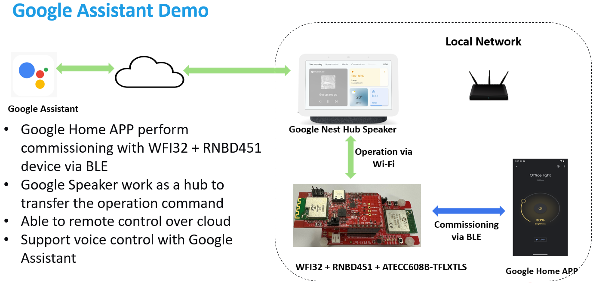
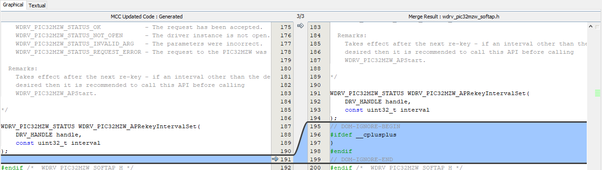

<a name="chiplightingexample"></a>

# Matter PIC32MZW1 Lighting Example

This MPLAB example demonstrates the use of Matter protocol over Microchip PIC32MZW1 based [WFI32-IoT board](https://ww1.microchip.com/downloads/aemDocuments/documents/WSG/ProductDocuments/UserGuides/EV36W50A-WFI32-IoT-Board-Users-Guide-DS50003262.pdf) and RNBD451 BLE Add On Board.

<hr>

- [PIC32MZW1 Lighting Example](#chip-pic32mzw1-lighting-example)

  - [Introduction](#introduction)
  - [Hardware Requirements](#hardware-requirements)
  - [Software Requirements](#software-requirements)
  - [Setup Environment - Install Prerequisites](#setup-chip-environment---install-prerequisites)
  - [Setup Hardware Platform](#setup-hardware-platform)
  - [Demo Introduction](#demo-introduction)
  - [Features](#features)
  - [Checking out Matter Repository](#checking-out-matter-repository)
  - [Build and Flash the example](#build-and-flash-the-example)
  - [Commissioning and Controlling Matter device](#commissioning-and-controlling-matter-device)
    - [Option 1: For testing purpose, by using CHIPTool APP](#option-1-for-testing-purpose-using-chiptool-app)
    - [Option 2: Google Ecosystem](#option-2-google-ecosystem)
  - [Attestation Certificate Provisioning](#attestation-certificate-provisioning)
  - [OTA Firmware Upgrade](#ota-firmware-upgrade)
  - [Memory Consumption](#memory-consumption)
  - [Limitations](#example-limitations)
  - [Add or modify Harmony 3 components and re-generate the code using MPLAB X IDE](#add-or-modify-harmony-3-components-and-regenerate-code-using-mplab-x-ide)
  - [Add or modify clusters](#add-or-modify-clusters)
  - [Reference](#reference)
  </hr>

<a name="intro"></a>

## Introduction

This example is a starting point for Matter protocol demonstration over Microchip's PIC32MZW1 Wi-Fi MCU and RNBD451 BLE module platform and gives an idea to control the Yellow LED on WFI32-IoT board using Android CHIPTool app (Matter Controller). During the initial release (Phase-1) of this example, we use the example certificates provided in the matter's repo for device attestation and embedded the certifcates in the project code. We also have option to generate the certificates and store in the ECC608 secure elements instead. To launch products in the market, certificates approved by [CSA](https://csa-iot.org/) are need to be used. 

- Note: This example was developed and tested using MPLAB X IDE v6.15+, MPLAB XC32 compiler v4.30 on Ubuntu 20.04 LTS and 22.04 LTS and on Microsoft Windows 10 Pro.


<a name="hwrequirements"></a>

## Hardware Requirements

- [WFI32-IoT Board](https://www.microchip.com/en-us/development-tool/EV36W50A)
- [RNBD451 Add On Board](https://www.microchip.com/en-us/development-tool/EV25F14A)
- [ATECC608B TRUST board DT100104](https://www.microchip.com/en-us/development-tool/DT100104) (optional for test)
- An Android phone running [Google Home APP (GHA)](https://play.google.com/store/apps/details?id=com.google.android.apps.chromecast.app&hl=en_US&gl=US)/ [Google Home Sample APP for Matter](https://developers.home.google.com/samples/matter-app)/ [CHIPTool app](assets/matterMicrochip.apk)
- Router/AP

<a name="softwarereq"></a>

## Software Requirements

- [MPLAB X IDE v6.15+](https://www.microchip.com/en-us/development-tools-tools-and-software/mplab-x-ide) and [follow the instructions to install IDE](https://microchipdeveloper.com/mplabx:installation). Also, select "MPLAB IPE" option during IDE installation.
- Check if the DFP v1.6.220 is installed. In MPLAB X IDE, from Menu bar -> Tools -> Packs -> locate "PIC32MZ-W_DFP" as below

</p>
  <p align="center">
  </p>

- [MPLAB XC32 Compiler v4.30](https://www.microchip.com/en-us/tools-resources/develop/mplab-xc-compilers/downloads-documentation#XC32) and [follow the instructions to install XC32 compiler](https://microchipdeveloper.com/xc32:installation).
  Use XC32 professional compiler license. Please refer tab 'Internal Microchip Licenses' from [Compilers Latest Builds Page](https://compilers.microchip.com/latest_builds.php) for more details about Internal Microchip Employee License Generator.

<a name="environment"></a>

## Setup CHIP Environment - Install Prerequisites

The project can support to build with MPLAB X IDE. When you build with MPLAB X IDE, you can run on Windows or Linux environment.
Below is the OS environment that you can use.
- Microsoft Windows OR
- [Linux](https://github.com/project-chip/connectedhomeip/blob/master/docs/guides/BUILDING.md#installing-prerequisites-on-linux) (Ubuntu release version 20.04 LTS, 22.04 LTS is preferred)


## Setup Hardware Platform
To prepare the hardware platform:
1. Load the appropriate FW to the RNBD451 Add On Board (you can contact Microchip Support to know more about the details of loading correct fw to RNBD451)
2. Connect J2 jumper to select MikroBus interface on RNBD451 Add On Board
</p>
  <p align="center">
  </p>
3. Turn on SW1 switch 2 or 3 or 4 for the use of ECC608B TrustFlex
</p>
  <p align="center">
  </p>
4. Plug the [ECC608B Trust board](https://www.microchip.com/en-us/development-tool/DT100104) to the MikroBus connecto of the [WFI32-IoT board](https://www.microchip.com/en-us/development-tool/EV36W50A), and then plug the [RNBD451 Add On Board](https://www.microchip.com/en-us/development-tool/EV25F14A) on top of ECC608B Trust board.  
Below picture show the details:

</p>
  <p align="center">
  </p>

- **Notes:** ECC608B Trust board is optional for test, if you want to disable the use fo ECC608B. To disable the use of ECC608B, you can disable the definition of "CHIP_DEVICE_CONFIG_ECC_INTEGRATION" in src/platform/wfi32/CHIPDevicePlatformConfig.h


<a name="demosetup"></a>
## Demo Introduction

The demo setup for Matter Lighting example includes an Android phone running [Google Home APP (GHA)](https://play.google.com/store/apps/details?id=com.google.android.apps.chromecast.app&hl=en_US&gl=US)/ [Google Home Sample APP for Matter](https://developers.home.google.com/samples/matter-app)/ [CHIPTool app](assets/matterMicrochip.apk), WFI32-IoT board and Router/AP. The following diagram shows the demo setup for WFI32-IoT board.

</p>
  <p align="center">
  </p>

<a name="exampfeatures"></a>

## Features

- This example supports OTA (Over-the-air) firmware upgrade feature
- MPLAB X IDE can be used on Microsoft Windows to build and flash the example
- Enables ON/OFF lighting cluster
- Supports device discovery and Commission over BLE
- Status LED (Blue color D403)
  - Blinking at 500ms ON/OFF : Attempting to connect to AP
  - Blinking at 200ms ON/OFF : Set as Soft-AP mode for network provisioning
  - Turned ON (SOLID ON) : Success to connect to AP
- Switch 1 (SW1)
  - Short Press : Enables Soft-AP mode
  - Long Press for 5 seconds : Factory Reset (Device can be re-commissioned to same AP)
- Switch 2 (SW2)
  - Short Press : Turns ON/OFF the Yellow LED, status is to sync to the cluster

<a name="checkoutchiprepo"></a>

## Checking out Matter Repository

- To check out the Matter repository:

```
git clone https://github.com/MicrochipTech/PIC32MZW1_Matter_Project.git
```

- Switch to branch "pic32mzw1_support_v1.1.0.1":

```
cd PIC32MZW1_Matter_Project/
git checkout pic32mzw1_support_v1.1.0.1
```

- Update submodules:

```
git submodule update --progress --init --recursive -- "third_party/nlassert/repo"
git submodule update --progress --init --recursive -- "third_party/nlio/repo"
git submodule update --progress --init --recursive -- "third_party/mbedtls/repo"
git submodule update --progress --init --recursive -- "examples/common/QRCode/repo"
```

<a name="buildexample"></a>

## Build and Flash the example

Update default Wi-Fi Access Point (AP) credentials in "/PIC32MZW1_Matter_Project/src/platform/wfi32/CHIPDevicePlatformConfig.h" file as below:

```
#define CHIP_DEVICE_CONFIG_DEFAULT_STA_SSID "DEMO_AP"
#define CHIP_DEVICE_CONFIG_DEFAULT_STA_PASSWORD "password"
```

  ### Build with MPLAB X IDE (Windows environment/ Linux environment)
   To build and flash the example using MPLAB X IDE on Microsoft Windows/ Ubuntu, execute following commands:

   ```
   $ cd PIC32MZW1_Matter_Project\third_party\wfi32
   $ Run the batch script - "mem_def_workaround.bat"
   $ Use MPLAB X IDE to open the project "matter_lighting_app_pic32mz_w1.X", available at PIC32MZW1_Matter_Project\third_party\wfi32\firmware
   $ Compile the project in MPLAB X IDE and program the flash
   ```
   The debug session can be started by referring to the steps mentioned [here.](https://microchipdeveloper.com/mplabx:start-a-debug-session) 


<a name="commissioncontrol"></a>

## Commissioning and Controlling Matter device

Once the WFI32-IoT board is programmed with this example, you have 3 ways to perform the demo. You can use [Google Home APP (GHA)](https://play.google.com/store/apps/details?id=com.google.android.apps.chromecast.app&hl=en_US&gl=US)/ [Google Home Sample APP for Matter](https://developers.home.google.com/samples/matter-app)/ [CHIPTool app](assets/matterMicrochip.apk) to perform next steps in verifying the lighting example with Android device.

If you need to test with Google Assistant, you can use the option 2 which use GHA to pair the Matter devices.

<a name="option1"></a>
### Option 1 For testing purpose using CHIPTool APP

More information about building and installing Android CHIPTool application can be found [here](https://github.com/project-chip/connectedhomeip/blob/master/docs/guides/android_building.md#building-android)

Alternatively, [follow the instructions to install](https://www.javatpoint.com/how-to-install-apk-on-android) Android CHIPTool app with generated Android debug package (.apk file) from your computer.

- Note: The device running Android CHIPTool app, should be connected to the same AP ***(configured [here](#building-the-example))***

  #### Step 1:

  Connect your samrtphone to the target AP that the Matter device need to be connected to.
  Enable Bluetooth in the setting page of your smartphone.
    
  #### Step 2:

  Use "PROVISION CHIP DEVICE WITH WI-FI" -> "INPUT DEVICE ADDRESS" tabs to start commissioning WFI32-IoT board with IP address.


  </p>
    <p align="center">
    </p>

  #### Step 3:

  Scan the on-board payload QR code

  </p>
    <p align="center">
    </p>
  
  #### Step 4:

  Input the target AP SSID and password, click **SAVE NETWORK**

  </p>
    <p align="center">
    </p>

  #### Step 5:

  CHIPTool app notifies successful commissioning of Matter device with message "Commissioning completed with result: 0". To proceed with controlling device, use "LIGHT ON/OFF & LEVEL CLUSTER" tab.

  </p>
    <p align="center">
    </p>

  #### Step 6:

  The Yellow LED on-board can be controlled - turned ON, OFF, toggled using respective tabs. The "READ" tab returns the On/Off command value.

  User can also press SW2 on-board to control ON, OFF the Yellow LED locally. The "READ" tab on the APP returns the On/Off command value.

  - Note: "Fabric ID" and "Device ID" fields will be auto populated.

  </p>
    <p align="center">
    </p>
    <p align="center">
    </p>

  - Note: If you need to re-commission the device, you can long press Switch 1 (SW1) for 5 sec to factory reset the device.  

### Option 2 Google Ecosystem

If you need to test the Matter devices with Google Home ecosystem (i.e. google assistant), you need to use Google Home APP (GHA) on android phone to pair the Matter devices. You also need to have a Google Nest devices function as Matter hubs in the Google Home ecosystem.
The Google Nest device can be Google Nest Hub (2nd gen)/ Google Home Mini. You can also find other supported Google Nest devices in this [page](https://developers.home.google.com/matter/supported-devices)  
Below picture show about the setup:  

   </p>
    <p align="center">
   </p>  

  #### Step 1:

  Create a developer project, which include Matter integration, are managed on the new [Google Home Developer Console](https://console.home.google.com/projects) 
  You can follow this [url](https://developers.home.google.com/matter/project/create) to create the project with Matter integration.
  Select the Vendor ID be 0xfff1 and Product ID be 0x8001 when you create the Matter Integration:
    </p>
    <p align="center">
    </p>

  #### Step 2:

  Set up the Google Nest devices (e.g. Google Nest Hub (2nd gen)) as the Matter Hubs and connect the devices to the same Wi-Fi network of the Matter devices (WFI32-IoT board) and the smartphone.

  #### Step 3:

  Install the [Google Home APP (GHA)](https://play.google.com/store/apps/details?id=com.google.android.apps.chromecast.app&hl=en_US&gl=US) to your Android smartphone which can be downloaded from Google Play Store

  #### Step 4:

  Verify the Matter Modules & Services on your smart phone by following this [guide](https://developers.home.google.com/matter/verify-services)

  #### Step 5:

  Connect your smartphone to the target AP that the Matter device need to be connected to.
  Enable Bluetooth in the setting page of your smartphone.

  #### Step 6:

  Pair the Matter device (WFI32-IoT board) over BLE by following this [guide](https://developers.home.google.com/matter/integration/pair)   
  The QR code string is printed in the serial console when it boots up. For example:
  ```
  CHIP:SVR: SetupQRCode: [MT:-24J0AFN00KA0648G00]
  CHIP:SVR: Copy/paste the below URL in a browser to see the QR Code:
  CHIP:SVR: https://project-chip.github.io/connectedhomeip/qrcode.html?data=MT%3A-24J0AFN00KA0648G00
  CHIP:SVR: Manual pairing code: [34970112332]
  ```

  Open the link in a web browser to display the QR code.

  #### Step 7:

  Use the Google Home APP(GHA) or speak to Google Assistant to control the Matter device (WFI32-IoT board). Users can get more information from this [guide](https://developers.home.google.com/matter/integration/control)  
  The Yellow LED on-board can be controlled - turned ON, OFF by toggle the device state from GHA or voice command with Google Assistant.

  User can also press SW2 on-board to control ON, OFF the Yellow LED locally. The device state is updated to the GHA.  

  </p>
    <p align="center">
    </p>

  - Note: If you need to re-commission the device, you can long press Switch 1 (SW1) for 5 sec to factory reset the device.  

<a name="otafwupgrade"></a>

## Attestation Certificate Provisioning

Matter Device Attestation Certificate (DAC) need to be provisioning to the ECC608B TrustFlex device for the commissioning process. It is used to proved that the device is certificed  and the manfacturer is the member of the Connectivity Standards Alliance (CSA).  
In this project, the DAC and the keys are stored in the ECC608B TrustFlex (secure element) , users need to run scripts to generate the keypair in the ECC608B TrustFlex, create the Matter DAC and provision the certificate to the ECC608B TrustFlex.  

### Environment Setup
Before your prepare certificates, you need to perform below steps in the Linux Ubuntu to prepare the environment
1. Go to the directory third_party/wfi32/utilities/cert_provision/ 
2. Run command to install cmake
    ```
    sudo apt-get install cmake
    ```
3. Run command to install python libraries
    ```
    pip install -r requirements.txt
    ```
    - **Note:** In case it fail to run the python scripts, try re-install cryptoauthlib module by below commands:
      ```
        pip3 uninstall cryptoauthlib
        pip3 install --no-cache cryptoauthlib
      ```
4. Run command to install libudev-dev
    ```
    sudo apt-get install libudev-dev
    ```
5. The Linux HID HAL files also require a udev rule to be added to change the permissions of the USB HID Devices. Please add a new udev rule for the Microchip CryptoAuth USB devices.
    ```
    cd /etc/udev/rules.d
    sudo touch mchp-cryptoauth.rules
    ```
    Edit the mchp-cryptoauth.rules file and add the following line to the file:
    ```
      Edit the mchp-cryptoauth.rules file and add the following line to the file:
    ```

### Prepare chip-cert tool
You need to compile the chip-cert tools on your Linux Ubuntu enviornment.  
Below are the steps:

1. Go to directory src/tools/chip-cert/
2. Compile the chip-cert tool according to steps shown in the readme file of this directoy


### Certificates Provisioning (For development and tests)
For project development and tests, you can perform below steps:


1. Go to the directory third_party/wfi32/utilities/cert_provision/
2. Copy the chip-cert tool from directory src/tools/chip-cert/ to the current directory
3. Copy files Matter-Development-PAI-noPID-Cert.pem and Matter-Development-PAI-noPID-Key.pem (Product Attestation Intermediate (PAI) certificate and key) from directory credentials/development/attestation/ to current directory
4. Use MPLABX IDE to open the project at directory third_party/wfi32/utilities/pic32mzw1_kitprotocol/firmware/pic32mzw1_kitprotocol.X, program the firmware to the WFI32-IoT Board
5. Connect WFi32-IoT board (with ECC608B Trust Board) to your PC
6. Execute below script 
    ```
      ./cert_create_and_prov.sh Matter-Development-PAI-noPID-Cert.pem Matter-Development-PAI-noPID-Key.pem
    ```  
    - **Note:** The above scripts do the below tasks:  
    1. Extract the public key from ECC608B TrustFlex
    2. Prepare the Device Attestation Certificates (DAC) using chip-tool, the DAC is signed by the (PAI) certificate and key
    3. Store store the DAC into the slot 10 of ECC608B TrustFlex
 

### Certificates Provisioning (For production)
For end product production , every device need to be installed a Device Attestation Certificates (DAC) that signed from the Matter certification authorities (CAs). Selected organzations get the authorization from Connectivity Standards Alliance (CSA) to be the Matter CA. When your product is certified, you can obtain the Product Attestation Intermediate (PAI) certificate and key from the Matter CA to sign the DAC of your prodcut.  
If you need to provision your device with the certificate that signed by the PAI from Matter CA, you can perform sames steps in above section (Certificates Provsioning (For development and tests) ) except you need to input the correct PAI certificat and key in step 4 when you execute the scripts cert_create_and_prov.sh

Another options for production is that you are setting up your own Public Key Infractructure (PKI) and create your own Attestation Authority (PAA) certificate and Product Attestation Intermediate (PAI) certificate. To do this, you need to get the authorization from CSA to be the Matter CA by following the Matter Certification Policy. 

You can perform below steps to created your won PAA and PAI and provision the device with the correspond DAC:

1. Go to the directory third_party/wfi32/utilities/cert_provision/
2. Copy the chip-cert tool from directory src/tools/chip-cert/ to the current directory
3. Execute below command to generate Product Attestation Authority (PAA) certificate and private key:
    ```
      ./chip-cert gen-att-cert --type a --subject-cn "Matter Development PAA 01" --valid-from "2020-10-15 14:23:43" --lifetime 7305 --out-key Chip-PAA-Key.pem --out Chip-PAA-Cert.pem
    ```
4. Execute below command to generate Product Attestation Authority (PAI) certificate and private key:
    ```
      ./chip-cert gen-att-cert --type i --subject-cn "Matter Development PAI 01" --subject-vid FFF1 --valid-from "2020-10-15 14:23:43" --lifetime 7305 --ca-key Chip-PAA-Key.pem --ca-cert Chip-PAA-Cert.pem --out-key Chip-PAI-Key.pem --out Chip-PAI-Cert.pem
    ```
5. Use MPLABX IDE to open the project at directory third_party/wfi32/utilities/pic32mzw1_kitprotocol/firmware/pic32mzw1_kitprotocol.X, program the firmware to the WFI32-IoT Board
6. Connect WFi32-IoT board (with ECC608B Trust Board) to your PC 
7. Execute below script to generate DAC and provisioin it to the ECC608B TrustFlex
    ```
      ./cert_create_and_prov.sh Chip-PAI-Cert.pem Chip-PAI-Key.pem
    ```   

## OTA Firmware Upgrade

  ### Build Process
   - The MPLAB X IDE based Example includes OTA and Bootloader features by default.

   - For GN system based example, follow the steps:
     - Navigate to "<MATTER_PROJECT_PATH>/PIC32MZW1_Matter_Project/" directory

   ```
   Build the Bootloader:

   $ /opt/microchip/mplabx/*/mplab_platform/bin/prjMakefilesGenerator.sh -v third_party/wfi32/bootloader/firmware/pic32mz_w1_curiosity.X@pic32mz_w1_curiosity
 
   $ /opt/microchip/mplabx/*/mplab_platform/bin/make -j32 -C third_party/wfi32/bootloader/firmware/pic32mz_w1_curiosity.X
   ```

   ```
   Build the Application example:

   $ ./scripts/examples/gn_wfi32_example.sh examples/lighting-app/mchp/pic32mzw1/ out/wfi32 linker_file=\"app_mz.ld\" enable_ota="true"
   ```

   ```
   Generate OTA image:

   $ /opt/microchip/xc32/<COMPILER_VERSION>/bin/xc32-objcopy -I ihex -O binary out/wfi32/chip-wfi32-lighting-example.hex out/wfi32/chip-wfi32-lighting-example.bin

   Note: <COMPILER_VER> is the compiler version installed/used, e.g. “v4.30”
   ```

   ```
   Generate the unified image that includes both the bootloader and example images:

   $ /opt/microchip/mplabx/*/mplab_platform/bin/hexmate --edf="/opt/microchip/mplabx/<MPLAB_VER>/mplab_platform/dat/en_msgs.txt" out/wfi32/chip-wfi32-lighting-example.hex third_party/wfi32/bootloader/firmware/pic32mz_w1_curiosity.X/dist/pic32mz_w1_curiosity/production/pic32mz_w1_curiosity.X.production.hex -oout/wfi32/chip-wfi32-lighting-example_unified.hex

   Note: <MPLAB_VER> is the MPLAB version installed/used, e.g. “v6.05”
   ```

  ### OTA Test Setup

   - Generate the OTA image
     - The OTA image is generated at <MATTER_PROJECT_PATH>\PIC32MZW1_Matter_Project\third_party\wfi32\firmware\matter_lighting_app_pic32mz_w1.X\dist\pic32mz_w1_curiosity\production\matter_lighting_app_pic32mz_w1.X.production.bin

     - Run below command to generate Matter OTA image that includes Matter specific header

  ```
    $ python ./src/app/ota_image_tool.py create -v 0xDEAD -p 0xBEEF -vn 2 -vs "2.0" -da sha256 ./third_party/wfi32/firmware/matter_lighting_app_pic32mz_w1.X/dist/pic32mz_w1_curiosity/production/matter_lighting_app_pic32mz_w1.X.production.bin matter_lighting_app_pic32mz_w1.X.production.ota
  ```

   - Set up OTA provider:
     - To perform OTA firmware upgrade, PIC32MZW1 device acts as OTA requestor and retrieves the OTA image from the OTA provider. Raspberry Pi can be used as OTA provider. 
       - Note: Guide to prepare Raspberry Pi as Matter device can be found [here](https://github.com/project-chip/connectedhomeip/blob/master/docs/guides/BUILDING.md)

     - Following two applications need to be run on Raspberry Pi, to verify working of Matter Lighting Example:
       - ota-provider-app
         [Build the application on Raspberry Pi](https://github.com/project-chip/connectedhomeip/tree/master/examples/ota-provider-app/linux)
  
       - chip-tool
         [Build the application on Raspberry Pi](https://github.com/project-chip/connectedhomeip/tree/master/examples/chip-tool)

   - Run the OTA tests on Raspberry Pi

  ```
    On Raspberry Pi (Terminal 1)
    $ ./chip-ota-provider-app -f matter_lighting_app_pic32mz_w1.X.production.ota

    On Raspberry Pi (Terminal 2)
    $ ./chip-tool pairing onnetwork 1 20202021

    $ ./chip-tool accesscontrol write acl '[{"fabricIndex": 1, "privilege": 5, "authMode": 2, "subjects": [112233], "targets": null}, {"fabricIndex": 1, "privilege": 3, "authMode": 2, "subjects": null, "targets": null}]' 1 0

    $ ./chip-tool pairing onnetwork 2 20202021

    $ ./chip-tool otasoftwareupdaterequestor announce-ota-provider 1 0 0 0 2 0
  ```

<a name="memconsumption"></a>

## Memory Consumption

As per latest memory usage analysis, this example consumes 943KB Program Memory and 238KB Data Memory.

<a name="examplimitations"></a>

## Example Limitations
- Debug mode cannot be used with MPLAB X IDE on Microsoft Windows
- It takes long loading time to start debug mode with MPLAB X IDE
- Requires MPLAB XC32 compiler's PRO license
- Device Commissioning over BLE with iPhone is not supported

<a name="addh3components"></a>

## Add or modify Harmony 3 components and re-generate the code using MPLAB X IDE
- If you need to customize the project, H3 services/libraries can be added or removed and peripherals or components such as GPIO, UART, SPI etc. can be configured through project graph option in MCC (MPLAB Code Configurator). The source code can be re-generated to include necessary changes.

  - MCC Project Configuration for PIC32MZW1 Lighting Example: 
</p>
  <p align="center">
  </p>

  - To re-generate the code using MCC, right click "Generate" and select "Force Update on All" as Merge Strategy:
</p>
  <p align="center">
  </p>

  - Do not merge following code, if the prompt messages are shown:
  </p>
    <p align="center">
    </p>
    <p align="center">
    </p>
    <p align="center">
    </p>
    <p align="center">
    </p>
    <p align="center">
    </p>
    <p align="center">
    </p>
    <p align="center">
    </p>
    <p align="center">
    </p>
    <p align="center">
    </p>
    <p align="center">
    </p>
    <p align="center">
    </p>
    <p align="center">
    </p>
    <p align="center">
    </p>
    <p align="center">
    </p>
    <p align="center">
    </p>
    <p align="center">
    </p>

<a name="addmodclusters"></a>

## Add or modify clusters

To customize the proejct, user can configure/enable/disable different clusters using ZAP GUI tool for cluster configuration. More information is available [here.](https://github.com/project-chip/connectedhomeip/tree/master/src/app/zap-templates)  
Application codes under directory PIC32MZW1_Matter_Project/examples/lighting-app/mchp/pic32mzw1/ need to be modified after the clusters configurations are changed.

  ### Pre-requisite for Linux
   - [Install node version 16.x for ZAP GUI tool](https://joshtronic.com/2021/05/09/how-to-install-nodejs-16-on-ubuntu-2004-lts/)

  #### Launch GUI and Configure Clusters
   - Execute the following commands:

```
$ cd PIC32MZW1_Matter_Project/
$ ./scripts/tools/zap/run_zaptool.sh <ZAP_FILE>
For example:
$ ./scripts/tools/zap/run_zaptool.sh examples/lighting-app/lighting-common/lighting-app.zap

$ ./scripts/tools/zap/generated.py <ZAP_FILE> -o <TEMPLATE_CODE_PATH>
For example:
$ ./scripts/tools/zap/generated.py examples/lighting-app/lighting-common/lighting-app.zap -o zzz_generated/lighting-app/zap-generated
```

  ### Pre-requisite for Windows
   - [Download node](https://nodejs.org/download/release/v16.18.0/) and move the node folder to C:\Program Files. Add "path-to-node.exe" to the environment PATH variable.
   - In command prompt, type: cd <MATTER_PROJECT_PATH>\PIC32MZW1_Matter_Project\third_party\zap\repo
   - Type: npm install installed-check

  #### Launch GUI and Configure Clusters
   - Execute the following command:
   
   ```
   $ node src-script/zap-start.js --logToStdout --gen  <MATTER_PROJECT_PATH>/PIC32MZW1_Matter_Project/src/app/zap-templates/app-templates.json --zcl  <MATTER_PROJECT_PATH>/PIC32MZW1_Matter_Project/src/app/zap-templates/zcl/zcl.json -I <ZAP_FILE_PATH>
   
   For example:
   $ node src-script/zap-start.js --logToStdout --gen <MATTER_PROJECT_PATH>/PIC32MZW1_Matter_Project/src/app/zap-templates/app-templates.json --zcl <MATTER_PROJECT_PATH>/PIC32MZW1_Matter_Project/src/app/zap-templates/zcl/zcl.json -i <MATTER_PROJECT_PATH>/PIC32MZW1_Matter_Project/examples/lighting-app/lighting-common/lighting-app.zap

   $ npm install installed-check
   ```

  #### Generate the template code 
   - Using command prompt, go to <MATTER_PROJECT_PATH>/PIC32MZW1_Matter_Project directory

</p>
  <p align="center">
  </p>

  - Execute the following command:

   ```
   $ python <ZAP_FILE> <TEMPLATE_CODE_PATH>
   
   For example:
   $ python scripts/tools/zap/generate.py examples\lighting-app\lighting-common\lighting-app.zap -o zzz_generated\lighting-app\zap-generated
   ```
  - Note: Template codes are generated at <TEMPLATE_CODE_PATH>
  
<a name="reference"></a>

## Reference
- The official Matter (project CHIP) github repo can be found [here.](https://github.com/project-chip/connectedhomeip)
- The official specification document can be downloaded by [submitting this request form](https://csa-iot.org/developer-resource/specifications-download-request/)
