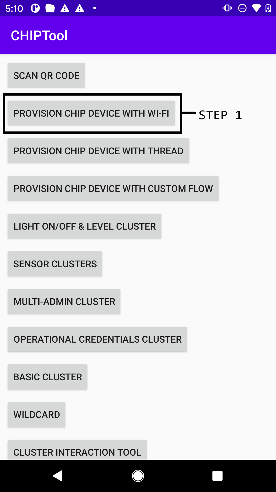
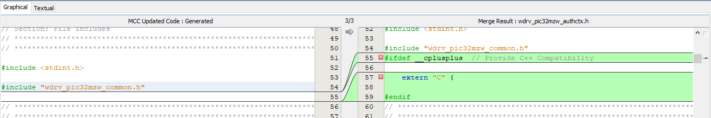
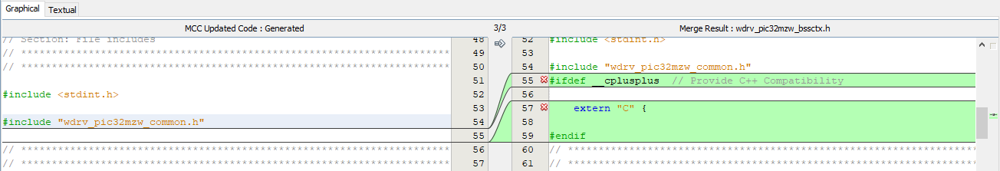

<a name="chiplightingexample"></a>

# Matter (*formerly* CHIP) PIC32MZW1 Lighting Example

This MPLAB example demonstrates the use of Matter protocol (also known as Project CHIP - Connected Home over IP) over Microchip PIC32MZW1 based [WFI32-IoT board](https://ww1.microchip.com/downloads/aemDocuments/documents/WSG/ProductDocuments/UserGuides/EV36W50A-WFI32-IoT-Board-Users-Guide-DS50003262.pdf)

<hr>

- [CHIP PIC32MZW1 Lighting Example](#chip-pic32mzw1-lighting-example)

  - [Introduction](#introduction)
  - [Hardware Requirements](#hardware-requirements)
  - [Setup CHIP Environment - Install Prerequisites](#setup-chip-environment---install-prerequisites)
  - [Software Requirements](#software-requirements)
  - [Demo Setup](#demo-setup)
  - [Features](#features)
  - [Checking out Matter Repository](#checking-out-matter-repository)
  - [Wi-Fi Network Provisioning](#wi-fi-network-provisioning)
  - [Build and Flash the example](#build-and-flash-the-example)
  - [Commissioning and Controlling Matter device](#commissioning-and-controlling-matter-device)
  - [OTA Firmware Upgrade](#ota-firmware-upgrade)
  - [Memory Consumption](#memory-consumption)
  - [Limitations](#example-limitations)
  - [Add or modify Harmony 3 components and re-generate the code using MPLAB X IDE](#add-or-modify-harmony-3-components-and-regenerate-code-using-mplab-x-ide)
  - [Add or modify clusters](#add-or-modify-clusters)
  - [Reference](#reference)
  </hr>

<a name="intro"></a>

## Introduction

This example is a starting point for Matter protocol demonstration over Microchip's PIC32MZW1 platform and gives an idea to control the Yellow LED on WFI32-IoT board using Android CHIPTool app (Matter Controller). During the initial release (Phase-1) of this example, we use the example certificates provided in the matter's repo for device attestation and embedded the certifcates in the project code. To launch products in the market, certificates approved by [CSA](https://csa-iot.org/) are need to be used. 

- Note: This example was developed and tested using MPLAB X IDE v6.00+, MPLAB XC32 compiler v4.20 on Ubuntu 20.04 LTS and 22.04 LTS and on Microsoft Windows 10 Pro.

<a name="hwrequirements"></a>

## Hardware Requirements

- [WFI32-IoT board](https://www.microchip.com/en-us/development-tool/EV36W50A)
- An Android Phone with [&#34;CHIPTool&#34; app](assets/matterMicrochip.apk) installed
- Router/AP (Needs no internet connectivity)

<a name="environment"></a>

## Setup CHIP Environment - Install Prerequisites

The project can support GN build system and MPLAB X IDE build. If you build with MPLAB X IDE, you can run on Windows or Linux environment. If you build with GN build system, you can run on Linux Environment.  
Below is the OS environment that you can use.
- Microsoft Windows OR
- [Linux](https://github.com/project-chip/connectedhomeip/blob/master/docs/guides/BUILDING.md#installing-prerequisites-on-linux) (Ubuntu release version 20.04 LTS, 22.04 LTS is preferred)

<a name="softwarereq"></a>

## Software Requirements

- [MPLAB X IDE v6.00+](https://www.microchip.com/en-us/development-tools-tools-and-software/mplab-x-ide) and [follow the instructions to install IDE](https://microchipdeveloper.com/mplabx:installation). Also, select "MPLAB IPE" option during IDE installation.
- Check if the DFP v1.6.220 is installed. In MPLAB X IDE, from Menu bar -> Tools -> Packs -> locate "PIC32MZ-W_DFP" as below

</p>
  <p align="center">
  </p>

- [MPLAB XC32 Compiler v4.20](https://www.microchip.com/en-us/tools-resources/develop/mplab-xc-compilers/downloads-documentation#XC32) and [follow the instructions to install XC32 compiler](https://microchipdeveloper.com/xc32:installation).
  Use XC32 professional compiler license. Please refer tab 'Internal Microchip Licenses' from [Compilers Latest Builds Page](https://compilers.microchip.com/latest_builds.php) for more details about Internal Microchip Employee License Generator.

- [Open JDK v8](https://docs.datastax.com/en/jdk-install/doc/jdk-install/installOpenJdkDeb.html) for GN build system. Please note that, this is a strict requirement to use Open JDK v8

  - Note:
    - For Ubuntu, add PATHs for MPLAB X IDE and XC32 Compiler's installation directories at the end of '~/.profile' OR '~/.bashrc' file:

    ```
      PATH=$PATH:"/opt/microchip/xc32/v4.20/bin"
      PATH=$PATH:"/opt/microchip/mplabx/v6.00/mplab_platform/mplab_ipe"
    ```

    - To continue using the same terminal, run `source ~/.profile` or `source ~/.bashrc`

<a name="demosetup"></a>

## Demo setup

The demo setup for Matter Lighting example includes an Android phone running [Google Home APP (GHA)](https://play.google.com/store/apps/details?id=com.google.android.apps.chromecast.app&hl=en_US&gl=US)/ [Google Home Sample APP for Matter](https://developers.home.google.com/samples/matter-app)/ [CHIPTool app](assets/matterMicrochip.apk), WFI32-IoT board and Router/AP (Needs no internet connectivity). The following diagram shows the demo setup for WFI32-IoT board.

</p>
  <p align="center">
  </p>

<a name="exampfeatures"></a>

## Features

- This example supports OTA (Over-the-air) firmware upgrade feature
- MPLAB X IDE can be used on Microsoft Windows to build and flash the example
- Enables ON/OFF lighting cluster
- Supports device discovery and Commission
- Status LED (Blue color D403)
  - Blinking at 500ms ON/OFF : Attempting to connect to AP
  - Blinking at 200ms ON/OFF : Set as Soft-AP mode for network provisioning
  - Turned ON (SOLID ON) : Success to connect to AP
- Switch 1 (SW1)
  - Short Press : Enables Soft-AP mode
  - Long Press for 5 seconds : Factory Reset (Device can be re-commissioned to same AP)
- Switch 2 (SW2)
  - Short Press : Turns ON/OFF the Yellow LED, status is to sync to the cluster

<a name="checkoutchiprepo"></a>

## Checking out Matter Repository

- To check out the Matter repository:

```
git clone https://github.com/MicrochipTech/PIC32MZW1_Matter_Project.git
```

- Switch to branch "pic32mzw1_support_v1":

```
cd PIC32MZW1_Matter_Project/
git checkout pic32mzw1_support_v1
```

- Update submodules:

```
git submodule update --progress --init --recursive -- "third_party/zap/repo"
git submodule update --progress --init --recursive -- "third_party/nlassert/repo"
git submodule update --progress --init --recursive -- "third_party/nlio/repo"
git submodule update --progress --init --recursive -- "third_party/mbedtls/repo"
git submodule update --progress --init --recursive -- "examples/common/QRCode/repo"
```

<a name="buildexample"></a>

## Build and Flash the example

Update default Wi-Fi Access Point (AP) credentials in "/PIC32MZW1_Matter_Project/src/platform/wfi32/CHIPDevicePlatformConfig.h" file as below:

```
#define CHIP_DEVICE_CONFIG_DEFAULT_STA_SSID "DEMO_AP"
#define CHIP_DEVICE_CONFIG_DEFAULT_STA_PASSWORD "password"
```
  ### For GN buid system (Linux environment)
   To build the example using GN build system on Ubuntu, execute following commands:

   ```
   cd PIC32MZW1_Matter_Project/
   ./scripts/examples/gn_wfi32_example.sh examples/lighting-app/mchp/pic32mzw1/ out/wfi32/
   ```

   To flash the example to WFI32-IoT board using CLI, run the following command:

   ```
   cd PIC32MZW1_Matter_Project/
   ipecmd.sh -TPPKOB4 -P32MZ1025W104132 -M -Fout/wfi32/chip-wfi32-lighting-example.hex -OL
   ```
   </p>
    <p align="center">
   </p>  

  ### For MPLAB X IDE (Windows environment/ Linux environment)
   To build and flash the example using MPLAB X IDE on Microsoft Windows/ Ubuntu, execute following commands:

   ```
   $ cd PIC32MZW1_Matter_Project\third_party\wfi32
   $ Run the batch script - "mem_def_workaround.bat"
   $ Use MPLAB X IDE to open the project "matter_lighting_app_pic32mz_w1.X", available at PIC32MZW1_Matter_Project\third_party\wfi32\firmware
   $ Compile the project in MPLAB X IDE and program the flash
   ```
   The debug session can be started by referring to the steps mentioned [here.](https://microchipdeveloper.com/mplabx:start-a-debug-session) 

<a name="network_provisioning"></a>

## Wi-Fi Network Provisioning

If you want to connect the WFI32-IoT board to the target AP other than the default settings, you can perform below steps:

  #### Step 1:
  Short press the Switch 1 (SW1), the WFI32-IoT board will reboot and start in softAP mode.
  
  The Blue LED on-board will blink at 200ms ON/OFF.
  </p>
    <p align="center">
      </p>

  #### Step 2:
  Connect your smartphone to WFI32-IoT board softAP, SSID is "INF-FFF1-8001" in OPEN security.

  #### Step 3:
  Launch the "Microchip WiFi Provisioning" [iOS](https://apps.apple.com/us/app/wi-fi-provisioning/id1553255731?platform=iphone) or [Android](https://play.google.com/store/apps/details?id=com.microchip.wifiapplication) APP on your iPhone or Android phone.
  
  Click "Connect" button
  </p>
    <p align="center">
      </p>
  
  #### Step 4:
  - Input the target AP SSID and password:
 Select the desired AP name from the app's scan result list and click "Send" button

  #### Step 5:
  WFI32-IoT Board receives the target AP credentials and connects to the target AP. The Blue LED on-board turns ON when connected to Wi-Fi. The Blue LED blinks at 500ms ON/OF,F if it fails to make the Wi-Fi connection.
  </p>
    <p align="center">
      </p>

- Note: The "Microchip Wi-Fi Provisioning" APP shown above is actually using a TCP client in the backend. The TCP client connects to WFI32-IoT TCP server and sends properly fomratted AP credentials.
User can use any other socket client app beside the smartphone APP.

  For example, user can use a PC to connect the WFI32-IoT softAP (SSID is "INF-FFF1-8001") and run below Python 2.7 based TCP client scripts. The WFI32-IoT board will reboot after it receive the AP credentials.

```python
import socket
sock = socket.socket(socket.AF_INET, socket.SOCK_STREAM)
# WFI32-IoT board runs an AP interface with IP address 192.168.1.1 and a TCP server on port 80
server_address = ('192.168.5.1', 80)
# Connect to the TCP socket
sock.connect(server_address)
# Send AP credentials over the connected socket to the WFI32-IoT board
# Replace 'ssid' with your AP SSID and 'password' with your AP password 
# Replace 'security' with proper value relevant to your AP security mode:
#0:Open | 1: WAP/WPA2 | 2:WEP | 3:WPA3 | 4:Enterprise
sock.sendall('apply,ssid,security,password,NULL')
# Send a 'finish' string over the socket to inform WFI32-IoT board to apply the passed credentials
sock.sendall('finish')
```

<a name="commissioncontrol"></a>

## Commissioning and Controlling Matter device

Once the WFI32-IoT board is programmed with this example, you have 3 ways to perform the demo. You can use [Google Home APP (GHA)](https://play.google.com/store/apps/details?id=com.google.android.apps.chromecast.app&hl=en_US&gl=US)/ [Google Home Sample APP for Matter](https://developers.home.google.com/samples/matter-app)/ [CHIPTool app](assets/matterMicrochip.apk) to perform next steps in verifying the lighting example with Android device.

If you need to test with Google Assistant, you can use the method 1 which use GHA to pair the Matter devices.

### Method 1: Use Google Home APP (GHA) and tests Matter devices in Google Home ecosystem

If you need to test the Matter devices with Google Home ecosystem (i.e. google assistant), you need to use Google Home APP (GHA) on android phone to pair the Matter devices. You also need to have a Google Nest devices function as Matter hubs in the Google Home ecosystem.
The Google Nest device can be Google Nest Hub (2nd gen)/ Google Home Mini. You can also find other supported Google Nest devices in this [page](https://developers.home.google.com/matter/supported-devices)  

  #### Step 1:

  Create a developer project, which include Matter integration, are managed on the new [Google Home Developer Console](https://console.home.google.com/projects) 
  You can follow this [url](https://developers.home.google.com/matter/project/create) to create the project with Matter integration.
  Select the Vendor ID be 0xfff1 and Product ID be 0x8001 when you create the Mattter Integration:
    </p>
    <p align="center">
    </p>

  #### Step 2:

  Set up the Google Nest devices (e.g. Google Nest Hub (2nd gen)) as the Matter Hubs and connect the devices to the same Wi-Fi network of the Matter devices (WFI32-IoT board) and the smartphnoe.

  #### Step 3:

  Install the [Google Home APP (GHA)](https://play.google.com/store/apps/details?id=com.google.android.apps.chromecast.app&hl=en_US&gl=US) to your Android smartphone which can be downloaded from Google Play Store

  #### Step 4:

  Verify the Matter Modules & Services on your smart phone by following this [guide](https://developers.home.google.com/matter/verify-services)

  #### Step 5:

  Pair the Matter device (WFI32-IoT board) by following this [guide](https://developers.home.google.com/matter/integration/pair)   
  The QR code string is printed in the serial console when it boots up. For example:
  ```
  CHIP:SVR: SetupQRCode: [MT:-24J0AFN00KA0648G00]
  CHIP:SVR: Copy/paste the below URL in a browser to see the QR Code:
  CHIP:SVR: https://project-chip.github.io/connectedhomeip/qrcode.html?data=MT%3A-24J0AFN00KA0648G00
  CHIP:SVR: Manual pairing code: [34970112332]
  ```

  Open the link in a web browser to display the QR code.

  #### Step 6:

  Use the Google Home APP(GHA) or speak to Google Assistant to control the Matter device (WFI32-IoT board). Users can get more information from this [guide](https://developers.home.google.com/matter/integration/control)  
  The Yellow LED on-board can be controlled - turned ON, OFF by toggle the device state from GHA or voice command with Google Assistant.

  User can also press SW2 on-board to control ON, OFF the Yellow LED locally. The device state is updated to the GHA.  

  </p>
    <p align="center">
    </p>

  - Note: If you need to re-commission the device, you can long press Switch 1 (SW1) for 5 sec to factory reset the device.  

### Method 2: Use Google Home Sample APP for Matter

The Google Home Sample App for Matter uses the [Google Home Mobile SDK](https://developers.home.google.com/matter/apis/home) to create an Android app that's similar to Google Home app (GHA) . This sample app support to commission the Matter devices to the Matter fabric and control the Matter devices.  

  #### Step 1:

  Download and Install the [Google Home Sample APP](https://developers.home.google.com/samples/matter-app) to your Android smartphone

  #### Step 2:

  Follow the [link](https://developers.home.google.com/samples/matter-app) to commission the matter devices.
  Pair the Matter device (WFI32-IoT board) by following this [guide](https://developers.home.google.com/matter/integration/pair)   
  The QR code string is printed in the serial console when it boots up. For example:
  
  ```
  CHIP:SVR: SetupQRCode: [MT:-24J0AFN00KA0648G00]
  CHIP:SVR: Copy/paste the below URL in a browser to see the QR Code:
  CHIP:SVR: https://project-chip.github.io/connectedhomeip/qrcode.html?data=MT%3A-24J0AFN00KA0648G00
  CHIP:SVR: Manual pairing code: [34970112332]
  ```

  Open the link in a web browser to display the QR code.

  #### Step 3:

  Control the Matter device by toggle your device On or Off on the APP.

  </p>
    <p align="center">
    </p>

   - Note: If you need to re-commission the device, you can long press Switch 1 (SW1) for 5 sec to factory reset the device. 

### Method 3: Use CHIPTool APP

More information about building and installing Android CHIPTool application can be found [here](https://github.com/project-chip/connectedhomeip/blob/master/docs/guides/android_building.md#building-android)

Alternatively, [follow the instructions to install](https://www.javatpoint.com/how-to-install-apk-on-android) Android CHIPTool app with generated Android debug package (.apk file) from your computer.

- Note: The device running Android CHIPTool app, should be connected to the same AP ***(configured [here](#building-the-example))***

  #### Step 1:

  Use "PROVISION CHIP DEVICE WITH WI-FI" -> "INPUT DEVICE ADDRESS" tabs to start commissioning WFI32-IoT board with IP address.


  </p>
    <p align="center">
    </p>

  #### Step 2:

  To find Matter devices connected to the same AP ***(configured [here](#building-the-example))***, with "Discriminator - 3840" and "Pincode - 20202021" use "DISCOVER" tab. For a single Matter device discovered on the network, "Device address" will be auto populated and when multiple Matter devices are discovered, select an entry from the list to populate the "Device address". To proceed with commissioning of the discovered Matter device, use "COMMISSION" tab.

  </p>
    <p align="center">
    </p>

  #### Step 3:

  CHIPTool app notifies successful commissioning of Matter device with message "Commissioning completed with result: 0". To proceed with controlling device, use "LIGHT ON/OFF & LEVEL CLUSTER" tab.

  </p>
    <p align="center">
    </p>

  #### Step 4:

  The Yellow LED on-board can be controlled - turned ON, OFF, toggled using respective tabs. The "READ" tab returns the On/Off command value.

  User can also press SW2 on-board to control ON, OFF the Yellow LED locally. The "READ" tab on the APP returns the On/Off command value.

  - Note: "Fabric ID" and "Device ID" fields will be auto populated.

  </p>
    <p align="center">
    </p>
    <p align="center">
    </p>

  - Note: If you need to re-commission the device, you can long press Switch 1 (SW1) for 5 sec to factory reset the device.  

<a name="otafwupgrade"></a>

## OTA Firmware Upgrade

  ### Build Process
   - The MPLAB X IDE based Example includes OTA and Bootloader features by default.

   - For GN system based example, follow the steps:
     - Navigate to "<MATTER_PROJECT_PATH>/PIC32MZW1_Matter_Project/" directory

   ```
   Build the Bootloader:

   $ /opt/microchip/mplabx/*/mplab_platform/bin/prjMakefilesGenerator.sh -v third_party/wfi32/bootloader/firmware/pic32mz_w1_curiosity.X@pic32mz_w1_curiosity
 
   $ /opt/microchip/mplabx/*/mplab_platform/bin/make -j32 -C third_party/wfi32/bootloader/firmware/pic32mz_w1_curiosity.X
   ```

   ```
   Build the Application example:

   $ ./scripts/examples/gn_wfi32_example.sh examples/lighting-app/mchp/pic32mzw1/ out/wfi32 linker_file=\"app_mz.ld\" enable_ota="true"
   ```

   ```
   Generate OTA image:

   $ /opt/microchip/xc32/<COMPILER_VERSION>/bin/xc32-objcopy -I ihex -O binary out/wfi32/chip-wfi32-lighting-example.hex out/wfi32/chip-wfi32-lighting-example.bin

   Note: <COMPILER_VER> is the compiler version installed/used, e.g. “v4.20”
   ```

   ```
   Generate the unified image that includes both the bootloader and example images:

   $ /opt/microchip/mplabx/*/mplab_platform/bin/hexmate --edf="/opt/microchip/mplabx/<MPLAB_VER>/mplab_platform/dat/en_msgs.txt" out/wfi32/chip-wfi32-lighting-example.hex third_party/wfi32/bootloader/firmware/pic32mz_w1_curiosity.X/dist/pic32mz_w1_curiosity/production/pic32mz_w1_curiosity.X.production.hex -oout/wfi32/chip-wfi32-lighting-example_unified.hex

   Note: <MPLAB_VER> is the MPLAB version installed/used, e.g. “v6.05”
   ```

  ### OTA Test Setup

   - Generate the OTA image
     - The OTA image is generated at <MATTER_PROJECT_PATH>\PIC32MZW1_Matter_Project\third_party\wfi32\firmware\matter_lighting_app_pic32mz_w1.X\dist\pic32mz_w1_curiosity\production\matter_lighting_app_pic32mz_w1.X.production.bin

     - Run below command to generate Matter OTA image that includes Matter specific header
     
  1. MPLAB X based build:

  ```
    $ python ./src/app/ota_image_tool.py create -v 0xDEAD -p 0xBEEF -vn 2 -vs "2.0" -da sha256 ./third_party/wfi32/firmware/matter_lighting_app_pic32mz_w1.X/dist/pic32mz_w1_curiosity/production/matter_lighting_app_pic32mz_w1.X.production.bin matter_lighting_app_pic32mz_w1.X.production.ota
  ```
  2. GN build:

  ```
    $ python ./src/app/ota_image_tool.py create -v 0xDEAD -p 0xBEEF -vn 2 -vs "2.0" -da sha256 out/wfi32/chip-wfi32-lighting-example.bin out/wfi32/chip-wfi32-lighting-example.ota
  ```

   - Set up OTA provider:
     - To perform OTA firmware upgrade, PIC32MZW1 device acts as OTA requestor and retrieves the OTA image from the OTA provider. Raspberry Pi can be used as OTA provider. 
       - Note: Guide to prepare Raspberry Pi as Matter device can be found [here](https://github.com/project-chip/connectedhomeip/blob/master/docs/guides/BUILDING.md)

     - Following two applications need to be run on Raspberry Pi, to verify working of Matter Lighting Example:
       - ota-provider-app
         [Build the application on Raspberry Pi](https://github.com/project-chip/connectedhomeip/tree/master/examples/ota-provider-app/linux)
  
       - chip-tool
         [Build the application on Raspberry Pi](https://github.com/project-chip/connectedhomeip/tree/master/examples/chip-tool)

   - Run the OTA tests on Raspberry Pi

  ```
    On Raspberry Pi (Terminal 1)
    $ ./chip-ota-provider-app -f matter_lighting_app_pic32mz_w1.X.production.ota

    On Raspberry Pi (Terminal 2)
    $ ./chip-tool pairing onnetwork 1 20202021

    $ ./chip-tool accesscontrol write acl '[{"fabricIndex": 1, "privilege": 5, "authMode": 2, "subjects": [112233], "targets": null}, {"fabricIndex": 1, "privilege": 3, "authMode": 2, "subjects": null, "targets": null}]' 1 0

    $ ./chip-tool pairing onnetwork 2 20202021

    $ ./chip-tool otasoftwareupdaterequestor announce-ota-provider 1 0 0 0 2 0
  ```

<a name="memconsumption"></a>

## Memory Consumption

As per latest memory usage analysis, this example consumes 892KB Program Memory and 238KB Data Memory.

<a name="examplimitations"></a>

## Example Limitations
- Debug mode cannot be used with MPLAB X IDE on Microsoft Windows
- It takes long loading time to start debug mode with MPLAB X IDE
- Requires MPLAB XC32 compiler's PRO license
- Example certificates provided in the matter's repo are used for device attestation, certificates are embedded in the program code.

<a name="addh3components"></a>

## Add or modify Harmony 3 components and re-generate the code using MPLAB X IDE
- If you need to customize the project, H3 services/libraries can be added or removed and peripherals or components such as GPIO, UART, SPI etc. can be configured through project graph option in MHC (MPLAB Harmony 3 Configurator). The source code can be re-generated to include necessary changes.

  - MHC Project Configuration for PIC32MZW1 Lighting Example: 
</p>
  <p align="center">
  </p>

  - To re-generate the code using MHC, select "USER_RECENT" as Merge Strategy:
</p>
  <p align="center">
  </p>

  - Do not merge following code, if the prompt messages are shown:
  </p>
    <p align="center">
    </p>
    <p align="center">
    </p>
    <p align="center">
    </p>
    <p align="center">
    </p>
    <p align="center">
    </p>
    <p align="center">
    </p>
    <p align="center">
    </p>
    <p align="center">
    </p>
    <p align="center">
    </p>
    <p align="center">
    </p>
    <p align="center">
    </p>

<a name="addmodclusters"></a>

## Add or modify clusters

To customize the proejct, user can configure/enable/disable different clusters using ZAP GUI tool for cluster configuration. More information is available [here.](https://github.com/project-chip/connectedhomeip/tree/master/src/app/zap-templates)  
Application codes under directory PIC32MZW1_Matter_Project/examples/lighting-app/mchp/pic32mzw1/ need to be modified after the clusters configurations are changed.

  ### Pre-requisite for Linux
   - [Install node version 16.x for ZAP GUI tool](https://joshtronic.com/2021/05/09/how-to-install-nodejs-16-on-ubuntu-2004-lts/)

  #### Launch GUI and Configure Clusters
   - Execute the following commands:

```
$ cd PIC32MZW1_Matter_Project/
$ ./scripts/tools/zap/run_zaptool.sh <ZAP_FILE>
For example:
$ ./scripts/tools/zap/run_zaptool.sh examples/lighting-app/lighting-common/lighting-app.zap

$ ./scripts/tools/zap/generated.py <ZAP_FILE> -o <TEMPLATE_CODE_PATH>
For example:
$ ./scripts/tools/zap/generated.py examples/lighting-app/lighting-common/lighting-app.zap -o zzz_generated/lighting-app/zap-generated
```

  ### Pre-requisite for Windows
   - [Download node](https://nodejs.org/download/release/v16.18.0/) and move the node folder to C:\Program Files. Add "path-to-node.exe" to the environment PATH variable.
   - In command prompt, type: cd <MATTER_PROJECT_PATH>\PIC32MZW1_Matter_Project\third_party\zap\repo
   - Type: npm install installed-check

  #### Launch GUI and Configure Clusters
   - Execute the following command:
   
   ```
   $ node src-script/zap-start.js --logToStdout --gen  <MATTER_PROJECT_PATH>/PIC32MZW1_Matter_Project/src/app/zap-templates/app-templates.json --zcl  <MATTER_PROJECT_PATH>/PIC32MZW1_Matter_Project/src/app/zap-templates/zcl/zcl.json -I <ZAP_FILE_PATH>
   
   For example:
   $ node src-script/zap-start.js --logToStdout --gen <MATTER_PROJECT_PATH>/PIC32MZW1_Matter_Project/src/app/zap-templates/app-templates.json --zcl <MATTER_PROJECT_PATH>/PIC32MZW1_Matter_Project/src/app/zap-templates/zcl/zcl.json -i <MATTER_PROJECT_PATH>/PIC32MZW1_Matter_Project/examples/lighting-app/lighting-common/lighting-app.zap

   $ npm install installed-check
   ```

  #### Generate the template code 
   - Using command prompt, go to <MATTER_PROJECT_PATH>/PIC32MZW1_Matter_Project directory

</p>
  <p align="center">
  </p>

  - Execute the following command:

   ```
   $ python <ZAP_FILE> <TEMPLATE_CODE_PATH>
   
   For example:
   $ python scripts/tools/zap/generate.py examples\lighting-app\lighting-common\lighting-app.zap -o zzz_generated\lighting-app\zap-generated
   ```
  - Note: Template codes are generated at <TEMPLATE_CODE_PATH>
  
<a name="reference"></a>

## Reference
- The official Matter (project CHIP) github repo can be found [here.](https://github.com/project-chip/connectedhomeip)
- The official specification document can be downloaded by [submitting this request form](https://csa-iot.org/developer-resource/specifications-download-request/)
