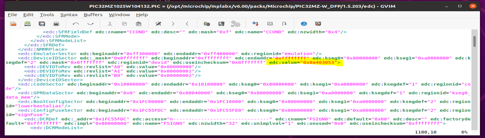
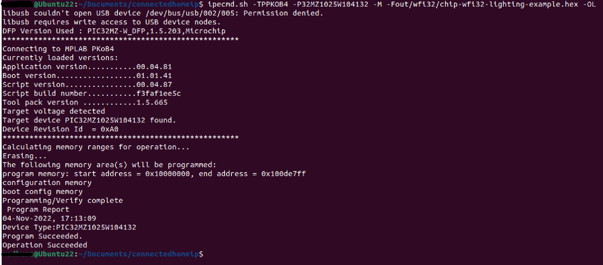
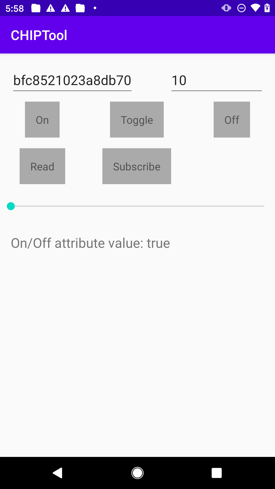

# CHIP PIC32MZW1 Lighting Application

This MPLAB application demonstrates the use of Matter protocol (also known as Project CHIP - Connected Home over IP) over Microchip PIC32MZW1 based [WFI32-IoT board](https://ww1.microchip.com/downloads/aemDocuments/documents/WSG/ProductDocuments/UserGuides/EV36W50A-WFI32-IoT-Board-Users-Guide-DS50003262.pdf)

<hr>

-   [CHIP PIC32MZW1 Lighting Application](#chip-pic32mzw1-lighting-application)
    -   [Introduction](#introduction)
    -   [Hardware Requirements](#hardware-requirements)
    -   [Setup CHIP Environment - Install Prerequisites](#setup-chip-environment---install-prerequisites)
    -   [Software Requirements](#software-requirements)
    -   [Checking out Matter Repository](#checking-out-matter-repository)
    -   [Building the application](#building-the-application)
    -   [Flashing the application](#flashing-the-application)
    -   [Commissioning and Controlling Matter device](#commissioning-and-controlling-matter-device)


### Introduction

This application is a starting point for Matter protocol demonstration over Microchip's PIC32MZW1 platform, and gives an idea to control the Yellow LED on WFI32-IoT board using Android CHIPTool app (Matter Controller). During the initial release (Phase-1) of this application, Wi-Fi Network credentials are hard coded. In this application, WFI32-IoT board is commissioned over Wi-Fi Network, using IPv4 address assigned to it.

- Note: This project was developed and tested using MPLAB X IDE v6.00, MPLAB XC32 compiler v4.20 TC9 on Ubuntu 20.04 LTS and 22.04 LTS.

### Hardware Requirements

- [WFI32-IoT board](https://www.microchip.com/en-us/development-tool/EV36W50A)

### Setup CHIP Environment - Install Prerequisites

Before getting ready to build the Matter application, you'll need to install a few OS specific dependencies.
-   [Linux](https://github.com/project-chip/connectedhomeip/blob/master/docs/guides/BUILDING.md#installing-prerequisites-on-linux)
-   [macOS](https://github.com/project-chip/connectedhomeip/blob/master/docs/guides/BUILDING.md#installing-prerequisites-on-macos)
-   [Raspberry Pi 4](https://github.com/project-chip/connectedhomeip/blob/master/docs/guides/BUILDING.md#installing-prerequisites-on-raspberry-pi-4)

### Software Requirements

- [MPLAB X IDE v6.00](https://www.microchip.com/en-us/development-tools-tools-and-software/mplab-x-ide) and [follow the instructions to install IDE](https://microchipdeveloper.com/mplabx:installation). Also, select "MPLAB IPE" option during IDE installation.

- [MPLAB XC32 v4.20 TC9](https://compilers.microchip.com/latest_builds.php) and [follow the instructions to install XC32 compiler](https://microchipdeveloper.com/xc32:installation).
Use XC32 professional compiler license. Please refer tab 'Internal Microchip Licenses' from [Compilers Latest Builds Page](https://compilers.microchip.com/latest_builds.php) for more details about Internal Microchip Employee License Generator.

    - Note: For Ubuntu, add PATHs for MPLAB X IDE and XC32 Compiler's installation directories at the end of '.profile' OR '.bashrc' file:

        - PATH=$PATH:"/opt/microchip/xc32/v4.20-TC9/bin"

        - PATH=$PATH:"/opt/microchip/mplabx/v6.00/mplab_platform/mplab_ipe"

- [Open JDK v8](https://docs.datastax.com/en/jdk-install/doc/jdk-install/installOpenJdkDeb.html) Please note that, this is a strict requirement to use Open JDK v8.

### Checking out Matter Repository

To check out the BitBucket based Matter repository:

```
$ git clone --recurse-submodules https://bitbucket.microchip.com/scm/~a16023/connectedhomeip.git
```

Switch to branch "pic32mzw1_support_v1":

```
$ cd path-to-connectedhomeip/
$ git checkout pic32mzw1_support_v1
```

### Building the application

Update Wi-Fi Access Point (AP) credentials in "/connectedhomeip/src/platform/wfi32/CHIPDevicePlatformConfig.h" file as below:

```
#define CHIP_DEVICE_CONFIG_DEFAULT_STA_SSID "DEMO_AP"
#define CHIP_DEVICE_CONFIG_DEFAULT_STA_PASSWORD "password"
```

```
$ cd path-to-connectedhomeip/
$ ./scripts/examples/gn_wfi32_example.sh examples/lighting-app/mchp/pic32mzw1/ out/wfi32/
```

### Flashing the application

Modify /opt/microchip/mplabx/v6.00/packs/Microchip/PIC32MZ-W_DFP/1.5.203/edc/PIC32MZ1025W104132.PIC file as below:
The highlighted value from below image is "0x08c03053" originally, please change it to "0x0a403053".
</p>
<p align="center">
</p>

```
$ cd path-to-connectedhomeip/
$ ipecmd.sh -TPPKOB4 -P32MZ1025W104132 -M -Fout/wfi32/chip-wfi32-lighting-example.hex -OL
```
</p>
<p align="center">
</p>

### Commissioning and Controlling Matter device

Once the WFI32-IoT board is programmed with this application, use [Android CHIPTool app](images/app-debug.apk) to perform next steps in verifying the lighting application behavior.

- Note: The device running Android CHIPTool app, should be connected to the same AP ***(configured [here](#building-the-application))***

    #### Step 1:
    Use "PROVISION CHIP DEVICE WITH WI-FI" -> "INPUT DEVICE ADDRESS" tabs to start commissioning WFI32-IoT board with IP address.
    </p>
    <p align="center">
    </p>
    
    #### Step 2:
    To find Matter devices connected to the same AP ***(configured [here](#building-the-application))***, with "Discriminator - 3840" and "Pincode - 20202021" use "DISCOVER" tab. For a single Matter device discovered on the network, "Device address" will be auto-populated and when multiple Matter devices are discovered, select an entry from the list to populate the "Device address". To proceed with commissioning of the discovered Matter device, use "COMMISSION" tab.
    </p>
    <p align="center">
    </p>

    #### Step 3:  
    CHIPTool app notifies successful commissioning of Matter device with message "Commissioning completed with result: 0". To proceed with controlling device, use "LIGHT ON/OFF & LEVEL CLUSTER" tab.
    </p>
    <p align="center">
    </p>

    #### Step 4:
    The LED on-board can be controlled - turned ON, OFF, Toggled using respective tabs. The "READ" tab returns the On/Off command value.

    - Note: "Fabric ID" and "Device ID" fields will be auto-populated.
    </p>
    <p align="center">
    </p>