<a name="chiplightingexample"></a>

# Matter (*formerly* CHIP) PIC32MZW1 Lighting Example

This MPLAB example demonstrates the use of Matter protocol (also known as Project CHIP - Connected Home over IP) over Microchip PIC32MZW1 based [WFI32-IoT board](https://ww1.microchip.com/downloads/aemDocuments/documents/WSG/ProductDocuments/UserGuides/EV36W50A-WFI32-IoT-Board-Users-Guide-DS50003262.pdf)

<hr>

- [CHIP PIC32MZW1 Lighting Example](#chip-pic32mzw1-lighting-example)

  - [Introduction](#introduction)
  - [Hardware Requirements](#hardware-requirements)
  - [Setup CHIP Environment - Install Prerequisites](#setup-chip-environment---install-prerequisites)
  - [Software Requirements](#software-requirements)
  - [Demo Setup](#demo-setup)
  - [Checking out Matter Repository](#checking-out-matter-repository)
  - [Build and Debug the example](#build-and-debug-the-example)
  - [Add or modify Harmony 3 components and re-generate the code using MPLAB X IDE](#add-or-modify-harmony-3-components-and-regenerate-code-using-mplab-x-ide)
  - [Add or modify clusters](#add-or-modify-clusters)
  - [Flash the example](#flash-the-example)
  - [Commissioning and Controlling Matter device](#commissioning-and-controlling-matter-device)
  - [OTA Firmware Upgrade](#ota-firmware-upgrade)
  - [Memory Consumption](#memory-consumption)
  - [Example Features](#example-features)
  - [Example Limitations](#example-limitations)
  - [Reference](#reference)
  </hr>

<a name="intro"></a>

## Introduction

This example is a starting point for Matter protocol demonstration over Microchip's PIC32MZW1 platform and gives an idea to control the Yellow LED on WFI32-IoT board using Android CHIPTool app (Matter Controller). During the initial release (Phase-1) of this example, Wi-Fi Network credentials are hard coded and WFI32-IoT board is commissioned over Wi-Fi Network, using IPv4 address assigned to it.

- Note: This example was developed and tested using MPLAB X IDE v6.00, MPLAB XC32 compiler v4.20 on Ubuntu 20.04 LTS and 22.04 LTS and on Microsoft Windows 10 Pro.

<a name="hwrequirements"></a>

## Hardware Requirements

- [WFI32-IoT board](https://www.microchip.com/en-us/development-tool/EV36W50A)
- An Android Phone with [&#34;CHIPTool&#34; app](assets/matterMicrochip.apk) installed
- Router/AP (Needs no internet connectivity)

<a name="environment"></a>

## Setup CHIP Environment - Install Prerequisites

Before getting ready to build the Matter example, you'll need to install a few OS specific dependencies.

- [Linux](https://github.com/project-chip/connectedhomeip/blob/master/docs/guides/BUILDING.md#installing-prerequisites-on-linux) (Ubuntu release version 20.04 LTS, 22.04 LTS is preferred)

<a name="softwarereq"></a>

## Software Requirements

- [MPLAB X IDE v6.00](https://www.microchip.com/en-us/development-tools-tools-and-software/mplab-x-ide) and [follow the instructions to install IDE](https://microchipdeveloper.com/mplabx:installation). Also, select "MPLAB IPE" option during IDE installation.
- Check if the DFP v1.6.220 is installed. In MPLAB X IDE, from Menu bar -> Tools -> Packs -> locate "PIC32MZ-W_DFP" as below

</p>
  <p align="center">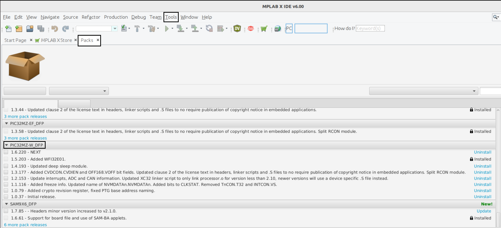
  </p>

- [MPLAB XC32 Compiler v4.20](https://www.microchip.com/en-us/tools-resources/develop/mplab-xc-compilers/downloads-documentation#XC32) and [follow the instructions to install XC32 compiler](https://microchipdeveloper.com/xc32:installation).
  Use XC32 professional compiler license. Please refer tab 'Internal Microchip Licenses' from [Compilers Latest Builds Page](https://compilers.microchip.com/latest_builds.php) for more details about Internal Microchip Employee License Generator.

- [Open JDK v8](https://docs.datastax.com/en/jdk-install/doc/jdk-install/installOpenJdkDeb.html) Please note that, this is a strict requirement to use Open JDK v8

  - Note:
    - For Ubuntu, add PATHs for MPLAB X IDE and XC32 Compiler's installation directories at the end of '~/.profile' OR '~/.bashrc' file:

    ```
      PATH=$PATH:"/opt/microchip/xc32/v4.20/bin"
      PATH=$PATH:"/opt/microchip/mplabx/v6.00/mplab_platform/mplab_ipe"
    ```

    - To continue using the same terminal, run `source ~/.profile` or `source ~/.bashrc`

<a name="demosetup"></a>

## Demo setup

The demo setup for Matter Lighting example includes an Android phone running CHIPTool app, WFI32-IoT board and Router/AP (Needs no internet connectivity). The following diagram shows the demo setup for WFI32-IoT board.

</p>
  <p align="center">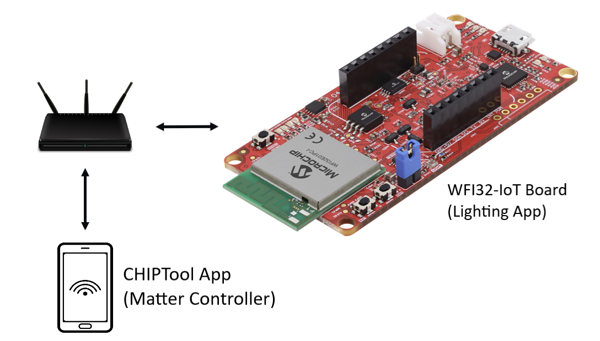
  </p>

<a name="checkoutchiprepo"></a>

## Checking out Matter Repository

- To check out the BitBucket based Matter repository:

```
$ git clone --recurse-submodules https://bitbucket.microchip.com/scm/~a16023/connectedhomeip.git
```

- Switch to branch "pic32mzw1_support_v1":

```
$ cd path-to-connectedhomeip/
$ git checkout pic32mzw1_support_v1
```

- Update submodules:

```
git submodule update --progress --init --recursive -- "third_party/zap/repo"
git submodule update --progress --init --recursive -- "third_party/nlassert/repo"
git submodule update --progress --init --recursive -- "third_party/nlio/repo"
git submodule update --progress --init --recursive -- "third_party/mbedtls/repo"
git submodule update --progress --init --recursive -- "examples/common/QRCode/repo"
```

<a name="buildexample"></a>

## Build and Debug the example

Update Wi-Fi Access Point (AP) credentials in "/connectedhomeip/src/platform/wfi32/CHIPDevicePlatformConfig.h" file as below:

```
#define CHIP_DEVICE_CONFIG_DEFAULT_STA_SSID "DEMO_AP"
#define CHIP_DEVICE_CONFIG_DEFAULT_STA_PASSWORD "password"
```

To build the example using CLI on Ubuntu, execute following commands:

```
$ cd path-to-connectedhomeip/
$ ./scripts/examples/gn_wfi32_example.sh examples/lighting-app/mchp/pic32mzw1/ out/wfi32/
```

To build the example using MPLAB X IDE on Microsoft Windows, execute following commands:

```
$ cd path-to-connectedhomeip\third_party\wfi32
$ Run the batch script - "mem_def_workaround.bat"
$ Use MPLAB X IDE to open the project "matter_lighting_app_pic32mz_w1.X", available at connectedhomeip\third_party\wfi32\firmware
$ Compile the project in MPLAB X IDE and program the flash
```
The debug session can be started by referring to the steps mentioned [here.](https://microchipdeveloper.com/mplabx:start-a-debug-session)

<a name="addh3components"></a>

## Add or modify Harmony 3 components and re-generate the code using MPLAB X IDE
- H3 services/libraries can be added or removed and peripherals or components such as GPIO, UART, SPI etc. can be configured through project graph option in MHC (MPLAB Harmony 3 Configurator) and the source code can be re-generated to include necessary changes.

  - MHC Project Configuration for PIC32MZW1 Lighting Example: 
</p>
  <p align="center">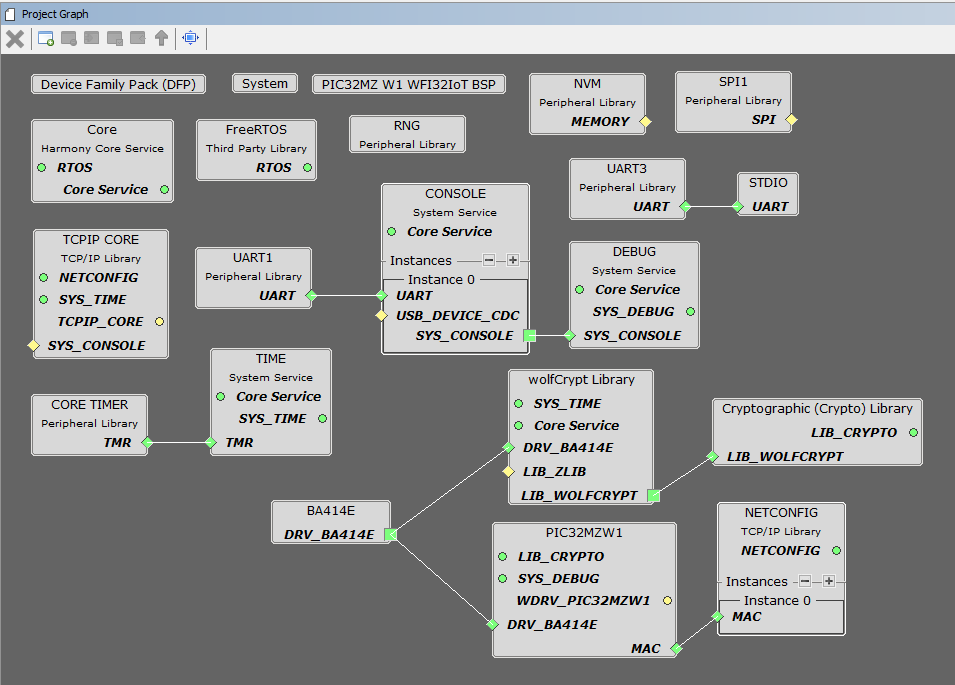
  </p>

  - To re-generate the code using MHC, select "USER_RECENT" as Merge Strategy:
</p>
  <p align="center">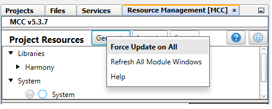
  </p>

  - Do not merge following code, if the prompt messages are shown:
  </p>
    <p align="center">
    </p>
    <p align="center">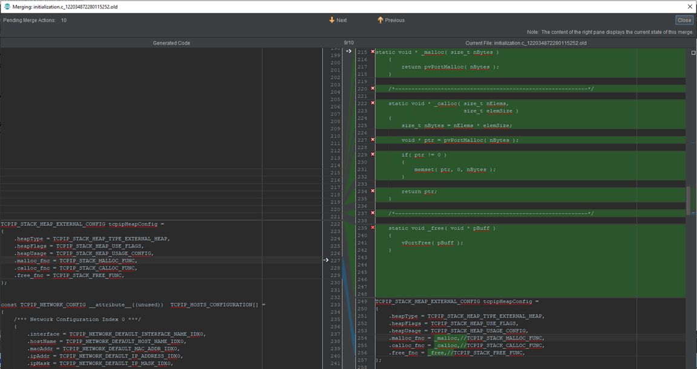
    </p>
    <p align="center">
    </p>
    <p align="center">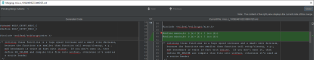
    </p>
    <p align="center">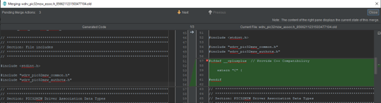
    </p>
    <p align="center">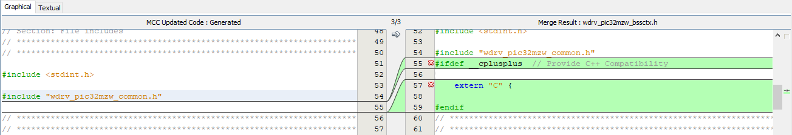
    </p>
    <p align="center">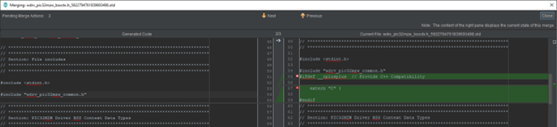
    </p>
    <p align="center">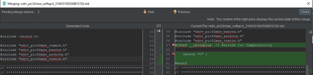
    </p>
    <p align="center">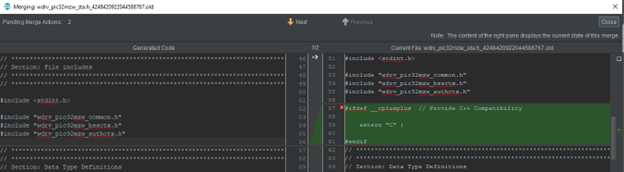
    </p>
    <p align="center">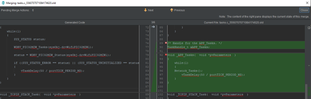
    </p>
    <p align="center">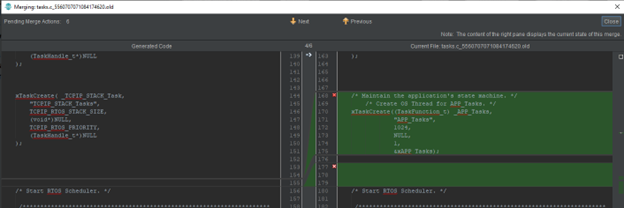
    </p>

<a name="addmodclusters"></a>

## Add or modify clusters

User can configure/enable/disable different clusters using ZAP GUI tool for cluster configuration. More information is available [here.](https://github.com/project-chip/connectedhomeip/tree/master/src/app/zap-templates)

  ### Pre-requisite for Linux
   - [Install node version 16.x for ZAP GUI tool](https://joshtronic.com/2021/05/09/how-to-install-nodejs-16-on-ubuntu-2004-lts/)

  #### Launch GUI and Configure Clusters
   - Execute the following commands:

```
$ cd path-to-connectedhomeip/
$ ./scripts/tools/zap/run_zaptool.sh <ZAP_FILE>
For example:
$ ./scripts/tools/zap/run_zaptool.sh examples/lighting-app/lighting-common/lighting-app.zap

$ ./scripts/tools/zap/generated.py <ZAP_FILE> -o <TEMPLATE_CODE_PATH>
For example:
$ ./scripts/tools/zap/generated.py examples/lighting-app/lighting-common/lighting-app.zap -o zzz_generated/lighting-app/zap-generated
```

  ### Pre-requisite for Windows
   - [Download node](https://nodejs.org/download/release/v16.18.0/) and move the node folder to C:\Program Files. Add "path-to-node.exe" to the environment PATH variable.
   - In command prompt, type: cd <MATTER_PROJECT_PATH>\connectedhomeip\third_party\zap\repo
   - Type: npm install installed-check

  #### Launch GUI and Configure Clusters
   - Execute the following command:
   
   ```
   $ node src-script/zap-start.js --logToStdout --gen  <MATTER_PROJECT_PATH>/connectedhomeip/src/app/zap-templates/app-templates.json --zcl  <MATTER_PROJECT_PATH>/connectedhomeip/src/app/zap-templates/zcl/zcl.json -I <ZAP_FILE_PATH>
   
   For example:
   $ node src-script/zap-start.js --logToStdout --gen C:/matter/connectedhomeip/src/app/zap-templates/app-templates.json --zcl C:/matter/connectedhomeip/src/app/zap-templates/zcl/zcl.json -i C:/matter/connectedhomeip/examples/lighting-app/lighting-common/lighting-app.zap

   $ npm install installed-check
   ```

  #### Generate the template code 
   - Using command prompt, go to <MATTER_PROJECT_PATH>/connectedhomeip directory

</p>
  <p align="center">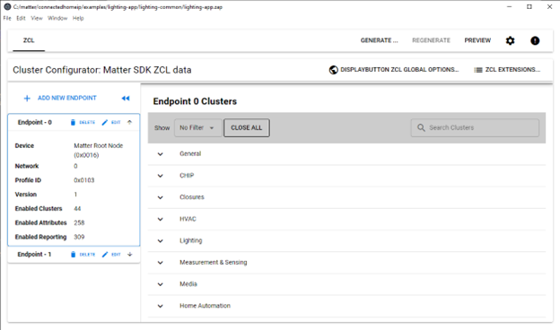
  </p>

  - Execute the following command:

   ```
   $ python <ZAP_FILE> <TEMPLATE_CODE_PATH>
   
   For example:
   $ python scripts/tools/zap/generate.py examples\lighting-app\lighting-common\lighting-app.zap -o zzz_generated\lighting-app\zap-generated
   ```
  - Note: Template codes are generated at <TEMPLATE_CODE_PATH>

<a name="flashexample"></a>

## Flash the example

To flash the example to WFI32-IoT board using CLI, run the following command:

```
$ cd path-to-connectedhomeip/
$ ipecmd.sh -TPPKOB4 -P32MZ1025W104132 -M -Fout/wfi32/chip-wfi32-lighting-example.hex -OL
```

</p>
  <p align="center">
  </p>

<a name="commissioncontrol"></a>

## Commissioning and Controlling Matter device

Once the WFI32-IoT board is programmed with this example, use [Android CHIPTool app](assets/matterMicrochip.apk) to perform next steps in verifying the lighting example with Android device.

More information about building and installing Android CHIPTool application can be found [here](https://github.com/project-chip/connectedhomeip/blob/master/docs/guides/android_building.md#building-android)

Alternatively, [follow the instructions to install](https://www.javatpoint.com/how-to-install-apk-on-android) Android CHIPTool app with generated Android debug package (.apk file) from your computer.

- Note: The device running Android CHIPTool app, should be connected to the same AP ***(configured [here](#building-the-example))***

  #### Step 1:

  Use "PROVISION CHIP DEVICE WITH WI-FI" -> "INPUT DEVICE ADDRESS" tabs to start commissioning WFI32-IoT board with IP address.


  </p>
    <p align="center">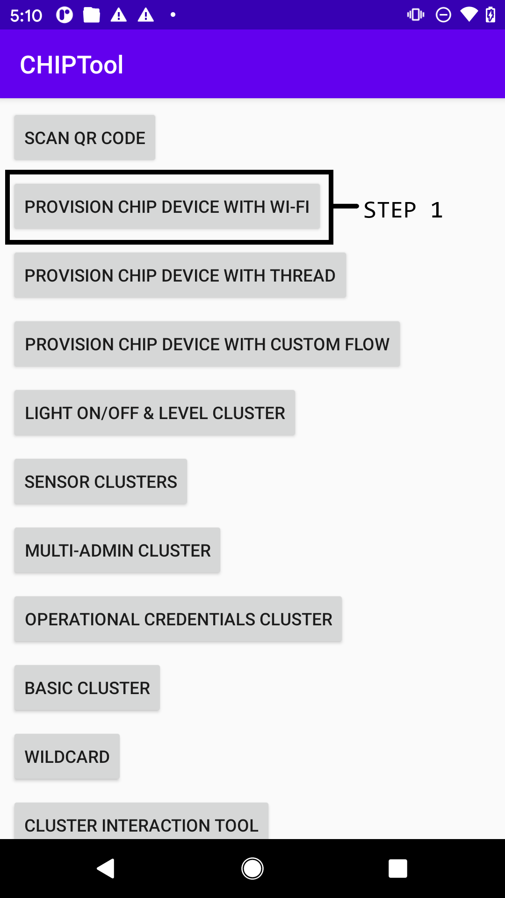
    </p>

  #### Step 2:

  To find Matter devices connected to the same AP ***(configured [here](#building-the-example))***, with "Discriminator - 3840" and "Pincode - 20202021" use "DISCOVER" tab. For a single Matter device discovered on the network, "Device address" will be auto populated and when multiple Matter devices are discovered, select an entry from the list to populate the "Device address". To proceed with commissioning of the discovered Matter device, use "COMMISSION" tab.

  </p>
    <p align="center">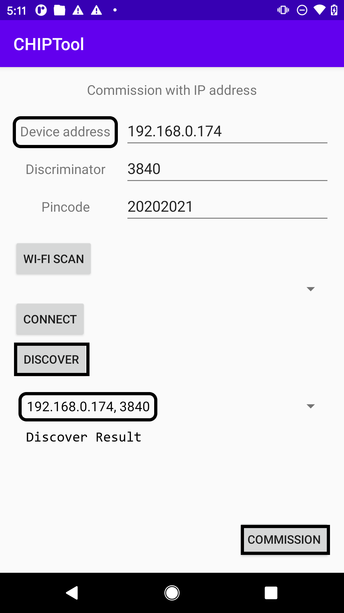
    </p>

  #### Step 3:

  CHIPTool app notifies successful commissioning of Matter device with message "Commissioning completed with result: 0". To proceed with controlling device, use "LIGHT ON/OFF & LEVEL CLUSTER" tab.

  </p>
    <p align="center">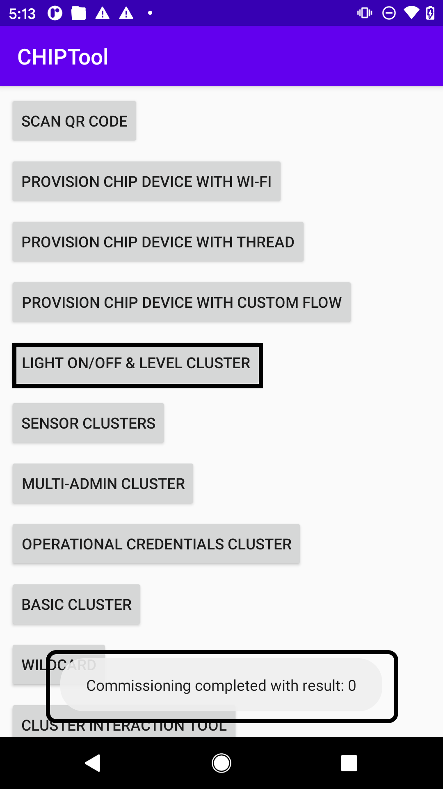
    </p>

  #### Step 4:

  The Yellow LED on-board can be controlled - turned ON, OFF, toggled using respective tabs. The "READ" tab returns the On/Off command value.

  - Note: "Fabric ID" and "Device ID" fields will be auto populated.

  </p>
    <p align="center">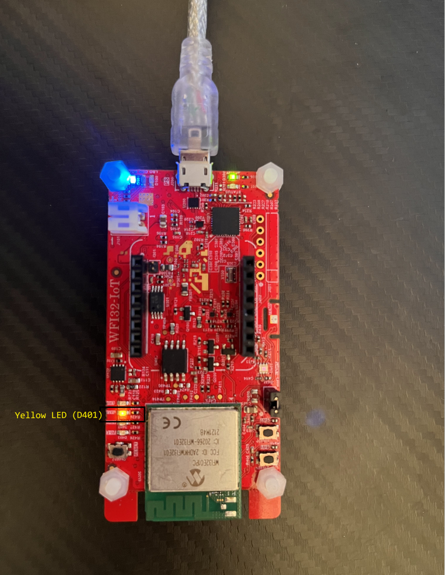
    </p>
    <p align="center">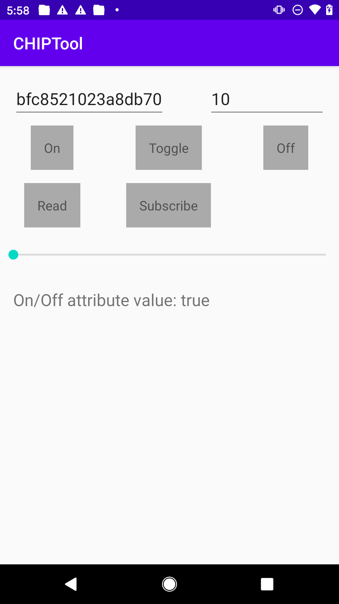
    </p>

<a name="otafwupgrade"></a>

## OTA Firmware Upgrade

  ### Build Process
   - The MPLAB X IDE based Example includes OTA and Bootloader features by default.

   - For GN system based example, follow the steps:
     - Navigate to "<MATTER_PROJECT_PATH>/connectedhomeip/" directory

   ```
   Build the Bootloader:

   $ /opt/microchip/mplabx/*/mplab_platform/bin/prjMakefilesGenerator.sh -v third_party/wfi32/bootloader/firmware/pic32mz_w1_curiosity.X@pic32mz_w1_curiosity

   For example: 
   $ /opt/microchip/mplabx/*/mplab_platform/bin/make -j32 -C third_party/wfi32/bootloader/firmware/pic32mz_w1_curiosity.X
   ```

   ```
   Build the example:

   $ ./scripts/examples/gn_wfi32_example.sh examples/lighting-app/mchp/pic32mzw1/ out/wfi32 linker_file=\"app_mz.ld\" enable_ota="true"
   ```

   ```
   Generate OTA image:

   $ /opt/microchip/xc32/<COMPILER_VERSION>/bin/xc32-objcopy -I ihex -O binary out/wfi32/chip-wfi32-lighting-example.hex out/wfi32/chip-wfi32-lighting-example.bin

   Note: <COMPILER_VER> is the compiler version installed/used, e.g. “v4.20”
   ```

   ```
   Generate the unified image that includes both the bootloader and example images:

   $ /opt/microchip/mplabx/*/mplab_platform/bin/hexmate --edf="/opt/microchip/mplabx/<MPLAB_VER>/mplab_platform/dat/en_msgs.txt" out/wfi32/chip-wfi32-lighting-example.hex third_party/wfi32/bootloader/firmware/pic32mz_w1_curiosity.X/dist/pic32mz_w1_curiosity/production/pic32mz_w1_curiosity.X.production.hex -oout/wfi32/chip-wfi32-lighting-example_unified.hex

   Note: <MPLAB_VER> is the MPLAB version installed/used, e.g. “v6.05”
   ```

  ### OTA Test Setup

   - Generate the OTA image
     - The OTA image is generated at <MATTER_PROJECT_PATH>\connectedhomeip\third_party\wfi32\firmware\matter_lighting_app_pic32mz_w1.X\dist\pic32mz_w1_curiosity\production\matter_lighting_app_pic32mz_w1.X.production.bin

     - Run below command to generate Matter OTA image that includes Matter specific header
     
  1. MPLAB X based build:

  ```
    $ python ./src/app/ota_image_tool.py create -v 0xDEAD -p 0xBEEF -vn 2 -vs "2.0" -da sha256 ./third_party/wfi32/firmware/matter_lighting_app_pic32mz_w1.X/dist/pic32mz_w1_curiosity/production/matter_lighting_app_pic32mz_w1.X.production.bin matter_lighting_app_pic32mz_w1.X.production.ota
  ```
  2. GN build:

  ```
    $ python ./src/app/ota_image_tool.py create -v 0xDEAD -p 0xBEEF -vn 2 -vs "2.0" -da sha256 out/wfi32/chip-wfi32-lighting-example.bin out/wfi32/chip-wfi32-lighting-example.ota
  ```

   - Set up OTA provider:
     - To perform OTA firmware upgrade, PIC32MZW1 device acts as OTA requestor and retrieves the OTA image from the OTA provider. Raspberry Pi can be used as OTA provider. 
       - Note: Guide to prepare Raspberry Pi as Matter device can be found [here](https://github.com/project-chip/connectedhomeip/blob/master/docs/guides/BUILDING.md)

     - Following two applications can be used with Raspberry Pi, to verify working of Matter Lighting Example:
       - ota-provider-app
         [Build the application on Raspberry Pi](https://github.com/project-chip/connectedhomeip/tree/master/examples/ota-provider-app/linux)
  
       - chip-tool
         [Build the application on Raspberry Pi](https://github.com/project-chip/connectedhomeip/tree/master/examples/chip-tool)

   - Run the OTA tests on Raspberry Pi

  ```
    On Raspberry Pi (Terminal 1)
    $ ./chip-ota-provider-app -f matter_lighting_app_pic32mz_w1.X.production.ota

    On Raspberry Pi (Terminal 2)
    $ ./chip-tool pairing onnetwork 1 20202021

    $ ./chip-tool accesscontrol write acl '[{"fabricIndex": 1, "privilege": 5, "authMode": 2, "subjects": [112233], "targets": null}, {"fabricIndex": 1, "privilege": 3, "authMode": 2, "subjects": null, "targets": null}]' 1 0

    $ ./chip-tool pairing onnetwork 2 20202021

    $ ./chip-tool otasoftwareupdaterequestor announce-ota-provider 1 0 0 0 2 0
  ```

<a name="memconsumption"></a>

## Memory Consumption

As per latest memory usage analysis, this example consumes 837KB Program Memory and 214.6KB Data Memory.

<a name="exampfeatures"></a>

## Example Features

- This example supports OTA (Over-the-air) firmware upgrade feature
- MPLAB X IDE can be used on Microsoft Windows to build and flash the example
- Enables ON/OFF lighting cluster
- Supports device discovery and Commission
- Status LED (Blue color D403)
  - Blinking at 500ms ON/OFF : Attempting to connect to AP
  - Blinking at 200ms ON/OFF : Set as Soft-AP mode for network provisioning
  - Turned ON (SOLID ON) : Success to connect to AP
- Switch 1 (SW1)
  - Short Press : Enables Soft-AP mode
  - Long Press for 3 seconds : Factory Reset (Device can be re-commissioned to same AP)
- Switch 2 (SW2)
  - Short Press : Turns ON/OFF the Yellow LED, status is to sync to the cluster

<a name="examplimitations"></a>

## Example Limitations
- Debug mode cannot be used with MPLAB X IDE on Microsoft Windows
- It takes long loading time to start debug mode with MPLAB X IDE on Ubuntu
- Wi-Fi provisioning details are hard-coaded for the phase-1 released version 
- Requires MPLAB XC32 compiler's PRO license


<a name="reference"></a>

## Reference
- The official Matter (project CHIP) github repo can be found [here.](https://github.com/project-chip/connectedhomeip)
- The official specification document can be downloaded by [submitting this request form](https://csa-iot.org/developer-resource/specifications-download-request/)
